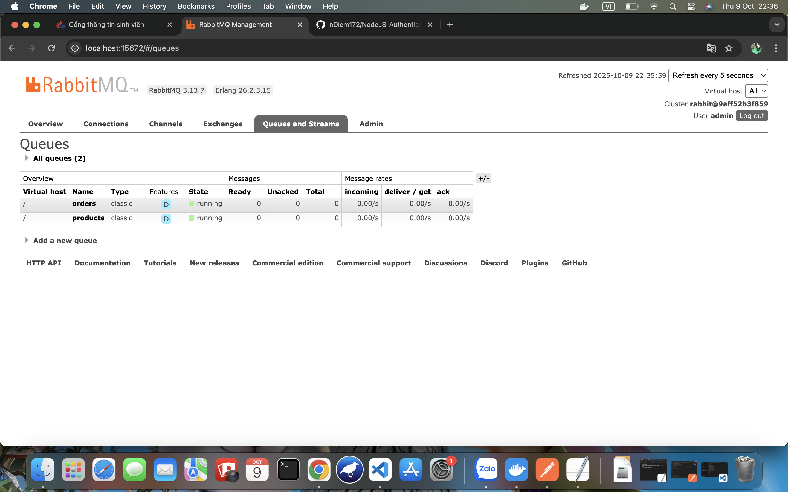

# EPROJECT-PHASE-1

## Download source code
git clone https://github.com/nDiem172/EProject-Phase-1.git

## Example `.env` file:

### .env auth
- MONGODB_AUTH_URI= mongodb://host:port/database
- JWT_SECRET= your_jwt_sercet

### .env order
- MONGODB_AUTH_URI= mongodb://host:port/database
- JWT_SECRET= your_jwt_secret
- MONGODB_PRODUCT_URI=mongodb://host:port/database
- MONGODB_ORDER_URI=mongodb://host:port/database

### .env product
- MONGODB_AUTH_URI=mongodb://host:port/database
- JWT_SECRET=your_jwt_sercet
- MONGODB_PRODUCT_URI=mongodb://host:port/database

## Test all business logic with POSTMAN
### Kết quả chạy docker

---------------
### Kết quả test postman với register

---------------
### Kết quả test postman với login

---------------
### Kết quả test postman với tạo product

---------------
### Kết quả test postman với order product

---------------
### Kết quả test postman với xem product

---------------
### Kết quả test postman với rabbit

---------------
### Kết quả mongo order và product

---------------
